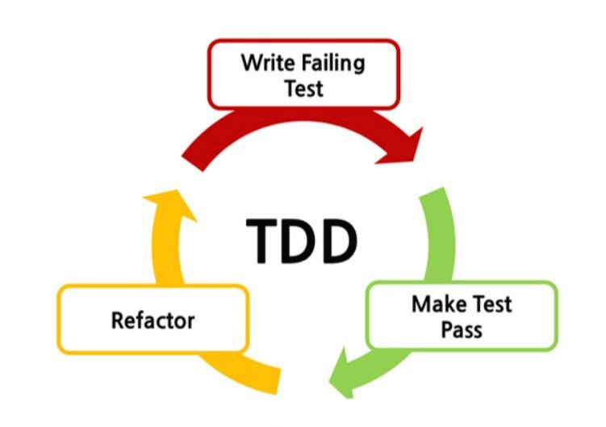
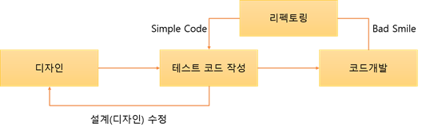

# ImageGenerator
해당 프로젝트는 TDD를 공부하기 위해 만든 프로젝트입니다.

# ‼️ WIP ‼️

# **개요**

TDD를 실제로 경험 해본적이 없고 실제로 아직 현재 다니는 회사에서도 이미 너무 업무가 많기 때문에 생산성을 위해서 TDD를 도입하지 않고 있지만 타 회사에서는 도입을 많이 하는거 같고 TDD만의 장점이 많아 보이기 때문에 아주 작은 프로젝트 하나를 TDD의 프로세스를 따라 개발하기 위해서 해당 프로젝트를 시작한다.

# TDD란?

TDD란 Test Driven Development의 약자로**'테스트 주도 개발'**이라고 한다. 반복 테스트를 이용한 소프트웨어 방법론으로, **작은 단위의 테스트 케이스**를 작성하고 이를 **통과하는 코드를 추가**하는 단계를 **반복하여 구현**한다.

짧은 개발 주기의 반복에 의존하는 개발 프로세스이며 애자일 방법론 중 하나인**eXtream Programming(XP)의 'Test-First'**개념에 기반을 둔 단순한 설계를 중요시한다. 이 기법을 개발했거나 '재발견' 한 것으로 인정되는 Kent Beck은 2003년에 TDD가 단순한 설계를 장려하고 자신감을 불어넣어 준다고 말하였다.



위의 그림대로 테스트 케이스를 만들고 패스하는 코드를 만들고 리펙토링하는 과정을 반복하는 개발이다.



TDD의 프로세스는 대략적으로 이런식으로 이번 프로젝트도 해당 프로세스를 기준으로 개발을 한다.

# 설계

그럼 프로젝트의 기본적인 스펙과 아키텍처를 구상한다.

아키텍처는 안드로이드 공식 레퍼런스에서 권장하는 **Layered Architecture** 채택한다. 

채택 이유는 Clean Architecture를 이용해서 앱을 만들어보고 수정도 해봤지만 아직 Layered Architecture으로는 해본적이 없고 Domain에 의존하는것이 아닌 Data에 가장 최종적으로 의존하는 아키텍처를 경험해보고 싶었다.

또한 **모듈화도 적용**한다.

모듈화의 기준은 기능을 위주로 나누고 권장되는 레이어에 되도록 맞도록 나눈다.

Compose, Retrofit2, Material3

를 이용해서 개발한다.

그리고 테스트에서 사용할 프레임워크는

Mockito, Junit, Espresso 정도를 고민하고 있다.

대략적인 설계는 끝났고 필요한 디자인을 하자.

사실 디자인이 중요하긴 보단 방법론을 지키며 개발하는 과정이 중요하기 때문에 디자인은 심플하게 한다. (물론 추후에도 복잡한 UI를 테스트 해야하는 경우가 생길수있으니 복잡한 UI로 수정해볼수 있다.

# 기술 명세서

바로 테스트 케이스를 적으면서 개발을 시작해야 할거 같지만 처음이니 좀 더 천천히 하기위해 우선 기술 명세서를 적어 어떤 기능이 필요한지를 적고 기술 명세서를 기준으로 테스트 케이스를 적을 예정이다.

1. 앱이 실행되면 간단한 splash 화면이 보여진다.
2. 사용자의 api key가 없을 경우, api key를 입력하는 설정창으로 이동한다.
3. api key를 입력하면 로컬에 key값을 저장한다.
    1. key가 비었을 경우 경고 메세지
    2. 저장이 완료 되면 토스트를 띄우고 첫화면으로 이동
4. 유저로부터 단어나 간단한 문장을 입력 받는다.
    1. 입력 제한은 10자로 한다. (정말 간단한 글로 상세한 프롬프트를 받을 예정이다.)
    2. 입력 제한이 넘어가면 더이상 입력되지 않고 입력뷰 하단에 빨간 경고 메세지가 보여진다.
    3. 복붙의 경우도 10자가 넘어갈 경우 10자로 제한되서 자른다.
5. 입력받은 문장을 제출하는 버튼을 누른다.
    1. 10자 제한을 체크한다.
    2. 입력이 없을 경우 빨간 경고 메세지가 보여지고 Request 되지 않는다.
6. 입력된 String은 chatGpt api로 Request를 한다.
7. Request에 따른 Response를 받는다.
    1. Response가 fail인 경우 유저에게 에러가 발생하였다고 안내한다.
8. Response로 ai로 프롬프트를 받아 화면에 보여진다.
9. 프롬프트를 다시 Image generation api를 통해서 Request를 호출한다.
    1. 프롬프트 길이 제한이 필요할까?
    2. 이미지 크기는 `1024x1024`
    3. 이미지는 4개를 호출한다.
10. 호출된 Request에 따른 이미지 Response를 화면에 보여준다.
    1. 이미지 크기는 `1024x1024`
    2. 이미지는 4개를 보여준다.

해당 기술 명세서는 개발하면서 업데이트가 될 예정이다.

# 테스트 케이스

이제 테스트 케이스를 만들자.

그전에 테스트 케이스에 적용할 규칙을 정한다.

## 테스트 케이스 Naming Convention

`메소드 이름_시나리오_예상 결과`

ex) getPost_success_postShouldCached

## 테스트 구조화

Given : 테스트 전에 필요한 객체나 데이터 준비

When : 객체, 데이터에 테스트를 할 함수를 사용하여 객체, 데이터에 상태 변화를 유도

Then : 변화된 값이 예상된 값과 맞는지 체크한다

## 테스트 코드 제작

```kotlin
@Test
fun displaySplashScreen_OnAppLaunch_ShowsSplashScreen() {}

@Test
fun checkApiKey_IfApiKeyNotFound_NavigatesToApiKeyEntryView() {}

@Test
fun saveApiKey_OnUserInput_SavesKeyToLocal() {}
@Test
fun saveApiKey_IfInputEmpty_ShowsWarningMessage() {}
@Test
fun saveApiKey_OnSuccessfulSave_DisplaysToastAndNavigatesToMainScreen() {}

@Test
fun acceptUserInput_OnTyping_AcceptsWordOrSimpleSentence() {}
@Test
fun enforceInputLimit_IfExceeds10Characters_LimitsInputTo10Chars() {}
@Test
fun enforceInputLimit_OnExceedingLimit_DisplaysWarningMessageUnderInputView() {}
@Test
fun handlePasteAction_IfExceeds10Characters_TrimsTo10Chars() {}

@Test
fun handleSubmissionButtonPress_OnClick_ChecksInputLengthLimit() {}
@Test
fun handleSubmissionButtonPress_IfInputEmpty_ShowsWarningAndDoesNotRequest() {}

@Test
fun makeRequest_OnInput_SubmitsInputToChatGPTAPI() {}

@Test
fun handleResponse_OnRequestReception_ReceivesResponseFromAPI() {}
@Test
fun handleResponse_IfResponseFail_InformsUserAboutError() {}

@Test
fun displayPrompt_OnSuccessfulResponse_DisplaysAIReceivedPromptOnScreen() {}

@Test
fun makeImageRequest_WithReceivedPrompt_CallsImageGenerationAPI() {}
@Test
fun handleImageResponse_OnRequestReception_DisplaysImageOnScreen() {}
@Test
fun handleImageResponse_IfImageSize1024_ChecksImageSize() {}
@Test
fun handleImageResponse_IfMoreThan4ImagesReceived_DisplaysFourImages() {}
```

위의 명세서를 기준으로 만든 테스트 코드이다.

물론 실제 개발하면서 네이밍은 변경 될 수도 있을듯하다.

(개발하지 않은 상태에서 이름을 정하는게 생각보다 힘들다.)